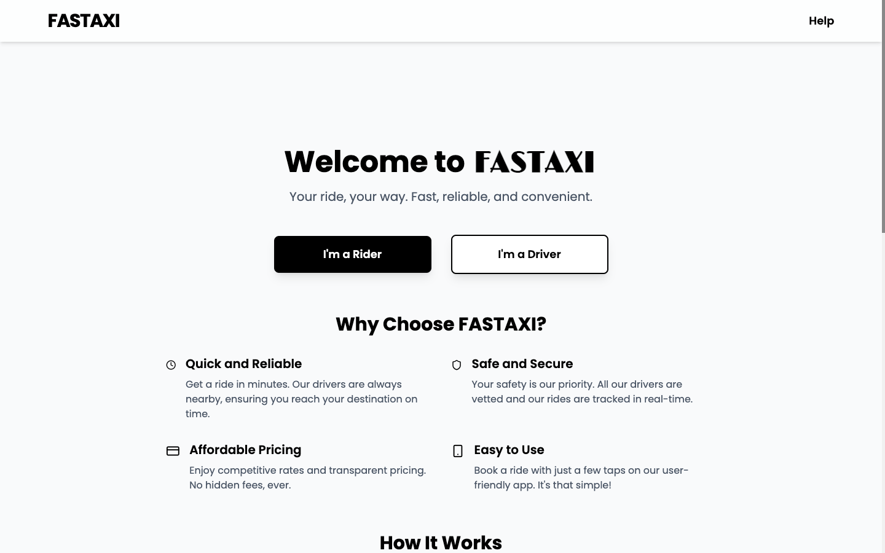
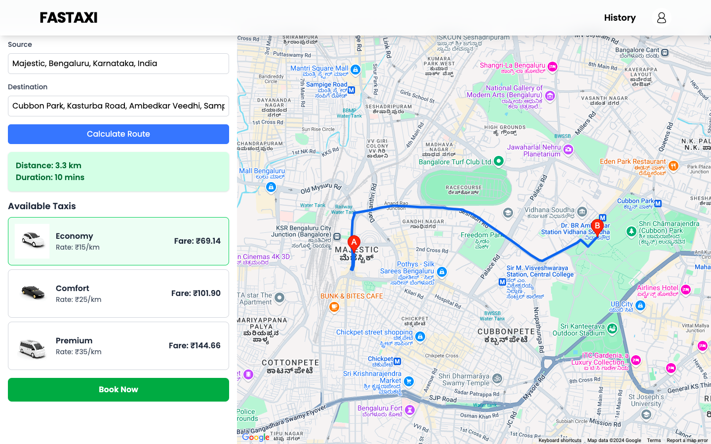

# ⚡️ Fastaxi

Fastaxi is a modern and reliable taxi booking application, offering an intuitive and seamless experience for users to book rides quickly and efficiently. Whether you’re a rider or a driver, Fastaxi ensures smooth operations with features tailored to your needs.

## 🌐 Website

[Visit Fastaxi](https://fastaxi.netlify.app)

## 🚀 Features

- ** Interactive Map Integration**: Powered by Google Maps API to calculate routes and display directions in real-time.
- ** Taxi Options**: Choose from Economy, Comfort, and Premium taxis with transparent pricing.
- ** Distance & Duration Estimation**: Automatically calculates the distance and estimated duration between source and destination.
- ** Responsive Design**: Fully optimized for both desktop and mobile devices.

---

## 📸 Screenshots

### Landing Page


### Booking Page


---

## 🛠 Tech Stack

- **Frontend**: React.js, CSS
- **Backend**: Node.js, Express.js
- **Database**: PostgreSQL
- **Mapping**: Google Maps API
- **Hosting**: Netlify

---

## 📦 Installation

### Prerequisites
- Node.js and npm installed on your system

### Steps
1. Clone the repository:
   ```bash
   git clone https://github.com/akash-abraham/fastaxi.git
   ```
2. Navigate to the project directory:
   ```bash
   cd fastaxi
   ```
3. Install dependencies:
   ```bash
   npm install
   ```
4. Start the development server:
   ```bash
   npm start
   ```
5. Open your browser and navigate to:
   ```
   http://localhost:3000
   ```

---

## 📝 How It Works

1. Enter the **Source** and **Destination**.
2. Click on **Calculate Route** to get distance and estimated time.
3. Choose from available taxi options (Economy, Comfort, Premium).
4. Confirm your booking and enjoy the ride!

---

## 📞 Support

For any issues or questions, feel free to reach out at: [akashabraham46@gmail.com](mailto:akashabraham46@gmail.com)

---

## 🌟 Show Your Support

If you like this project, please consider giving it a ⭐ on [GitHub](https://github.com/akash-abraham/fastaxi)!

---

## 📄 License

This project is licensed under the MIT License. See the [LICENSE](LICENSE) file for details.


